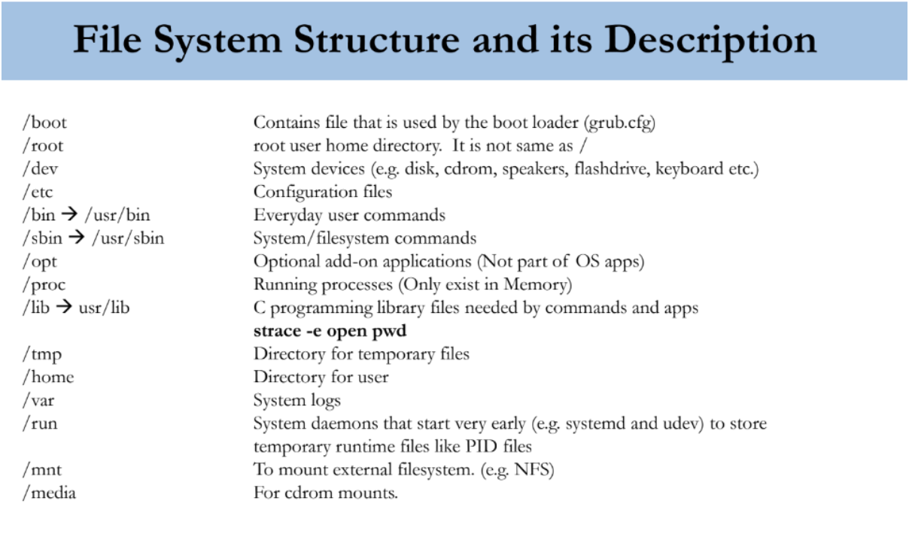

# Basic command

lscpu : list cpu info

lsusb : list usb info

cat /proc/cpuinfo

cat /proc/meminfo

cat /proc/version

cat /etc/redhat-release

uname -a : get Kernal info

free -m : check RAM status

df -h : Show information about the file system on which each FILE resides, or all file systems by default.

du -sh

du -ah

lspci : mainboard information

ifconfig : network information

hostname : domain information

arch : server architecture

cat /proc/swaps : check swaps memory

last reboot : reboot history

mkdir

cd

pwd

tree

du

mv

rmdir

rm -rf

## Shutdown
shutdown -h now: shutdown immediately

shutdown -r now: shutdown and restart immediately

shutdown -h 11:00: shutdown at 11:00

## Runlevel
RunLevel 1: che do single-user mode -> chi root co quyen truy cap

RunLevel 2:: multi-user -> ko dung mang

RunLevel 3: multi-user with networks

RunLevel 4: ko su dung

RunLevel 5: multi-user mode with GUI

RunLevel 6: reboot

## File system

/boot : chua cac tap tin dung de khoi dong he dieu hanh

/root ko giong voi home directory

/dev chua cac tap tin thiet bi cua he thong disk, cdrom, keyboard

/etc chua tap tin cau hinh

/bin /usr/bin chua cac lenh thong dung cho nguoi dung hang ngay

/sbin lenh he thong va file he thong

/opt Chua option tuy chinh cua he dieu hanh

/proc Chua process dang chay

/usr/lib Chua nhung thu vien cho nguoi lap trinh

/tmp File tmp

/var Chua file log

mkdir -p ~/linux/{a/1.{1..5},b/2.{2..6},c/{c1/c1{1..3},c2/c2{1/{1,2},2}}}

* Output:

## File management commands

ls: Liệt kê thông tin các tập tin và thư mục.

touch: Tạo tập tin rỗng.

cat: Đọc tập tin.

tac: Đọc tập tin ngược.

head: Đọc 10 dòng đầu tiên của tập tin.

tail: Đọc 10 dòng cuối của tập tin.

cp: Copy tập tin.

mv: Di chuyển, đổi tên tập tin.

rm: Xóa tập tin

## Định hướng xuất, nhập và cơ chế đường ống (pipe)

>, >>    ex: tree > /root/tree.txt

<

| : lenh A | lenh B | lenh C OutputA | Input B, output B | Input C , output C > thongtin.txt

> dinh huong ghi de -> stdout ->

>> dinh huong append, tuong tu nhu > , them noi dung moi vao cuoi tap tin da ton tai

< dung de chuyen huong nhap chuan (stdin) cua mot lenh tu tap tin

2>  dieu huong loi ra ngoai

&> /dev/null: null device, noi bat ky du lieu ghi ra deu bo qua

> stdout

2> : dieu huong loi stderr den mot tajp tin

>>

2>>

>& chuyen uong ca dau-ra tieu chuan va dau-ra loi stdout va stderr

Shebang

